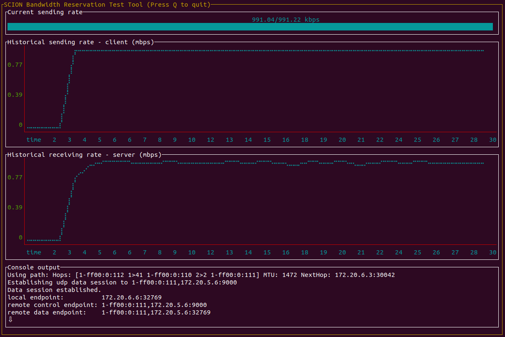

# Bandwidth Allocation System Library
[](https://pkg.go.dev/github.com/anapaya/bwallocation)
[](https://github.com/anapaya/bwallocation/actions?query=workflow%3AGo)
[](https://goreportcard.com/report/github.com/anapaya/bwallocation)
[](https://github.com/anapaya/bwallocation/issues?q=is%3Aopen+is%3Aissue+label%3A%22help+wanted%22)
[](https://github.com/anapaya/bwallocation/issues?q=is%3Aopen+is%3Aissue+label%3A%22good+first+issue%22)
[](https://github.com/anapaya/bwallocation/releases)
[](https://github.com/Anapaya/bwallocation/blob/main/LICENSE)

`bwallocation` is a go library for establishing bandwidth reservations in the
bandwidth allocation system.


## Installation

```txt
go get -u github.com/anapaya/bwallocation/cmd/bwreserver
```

## Usage

This package defines a go library to interact with the bandwidth allocation
system. Check the [go
documentation](https://pkg.go.dev/github.com/anapaya/bwallocation) for more
details.

The sample application `bwreserver` showcases how bandwidth reservations can
be obtained and used. The application runs in client and server mode.

### Server Usage

```
Usage:
  bwreserver server [flags]

Examples:
  bwreserver server --local :9000

Flags:
      --dispatcher string   dispatcher socket (default "/run/shm/dispatcher/default.sock")
  -h, --help                help for server
      --local udp-addr      Address to listen on (default :9000)
      --log.level string    Console logging level verbosity (debug|info|error)
      --pprof tcp-addr      Address to serve pprof (default :0)
      --sciond string       SCION Daemon address (default "127.0.0.1:30255")
```

### Client Usage

```txt
The client supports two protocols UDP/SCION and QUIC/SCION. By default UDP/SCION
is used. QUIC/SCION can be enabled with the appropriate flag.

The paths can be filtered according to a sequence. A sequence is a string of
space separated HopPredicates. A Hop Predicate (HP) is of the form
'ISD-AS#IF,IF'. The first IF means the inbound interface (the interface where
packet enters the AS) and the second IF means the outbound interface (the
interface where packet leaves the AS).  0 can be used as a wildcard for ISD, AS
and both IF elements independently.

HopPredicate Examples:

  Match any:                               0
  Match ISD 1:                             1
  Match AS 1-ff00:0:133:                   1-ff00:0:133
  Match IF 2 of AS 1-ff00:0:133:           1-ff00:0:133#2
  Match inbound IF 2 of AS 1-ff00:0:133:   1-ff00:0:133#2,0
  Match outbound IF 2 of AS 1-ff00:0:133:  1-ff00:0:133#0,2

Sequence Examples:

  sequence: "1-ff00:0:133#0 1-ff00:0:120#2,1 0 0 1-ff00:0:110#0"

The above example specifies a path from any interface in AS 1-ff00:0:133 to
two subsequent interfaces in AS 1-ff00:0:120 (entering on interface 2 and
exiting on interface 1), then there are two wildcards that each match any AS.
The path must end with any interface in AS 1-ff00:0:110.

  sequence: "1-ff00:0:133#1 1+ 2-ff00:0:1? 2-ff00:0:233#1"

The above example includes operators and specifies a path from interface
1-ff00:0:133#1 through multiple ASes in ISD 1, that may (but does not need to)
traverse AS 2-ff00:0:1 and then reaches its destination on 2-ff00:0:233#1.

Available operators:

  ? (the preceding HopPredicate may appear at most once)
  + (the preceding ISD-level HopPredicate must appear at least once)
  * (the preceding ISD-level HopPredicate may appear zero or more times)
  | (logical OR)

Usage:
  bwreserver client <server-addr> [flags]

Examples:
  bwreserver client 1-ff00:0:112,127.0.0.1:9000 -s 5mbps -d 10
  bwreserver client 1-ff00:0:112,127.0.0.1:9000 -s 10mbps -r 5mbps
  bwreserver client 1-ff00:0:112,127.0.0.1:9000 --text


Flags:
  -d, --duration int          duration of the data transmission in seconds.
                              0 or negative values will keep the data transmission going indefinitely.
  -h, --help                  help for client
  -i, --interactive           interactive mode
      --local ip              IP address to listen on
      --log.level string      Console logging level verbosity (debug|info|error)
      --payload int           payload size in bytes (default 1280)
      --pprof tcp-addr        Address to serve pprof (default :0)
      --quic                  use QUIC when sending data. If not specified, UDP is used.
  -r, --reservation string    bandwidth to reserve. Setting this lower than sending rate simulates malicious behavior.
                              supported values:
                                <bandwidth>:  Reserve the specified bandwidth
                                sending-rate: Use same value as sending-rate
                                none:         Do not reserve any bandwidth
                               (default "sending-rate")
      --sciond string         SCION Daemon address (default "127.0.0.1:30255")
  -s, --sending-rate string   rate the client attempts to send at (default "1mbps")
      --sequence string       Space separated list of hop predicates
      --text                  use simple text mode. If not specified, the CLI widgets output is used.
```

## Screenshots



## Development

The following requirements are assumed for development:

- go                 v1.15
- mockgen            v1.4.4
- protoc             v3.11.4
- protoc-gen-go      v1.22.0
- protoc-gen-go-grpc v1.0.1


### Running tests

```
make test
```

### Regenerating Mock Files

```
make mocks
```

### Regenerating Protobuf Files

```
make proto
```
